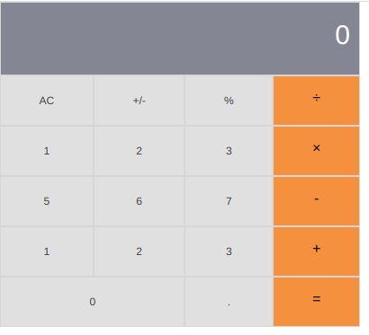
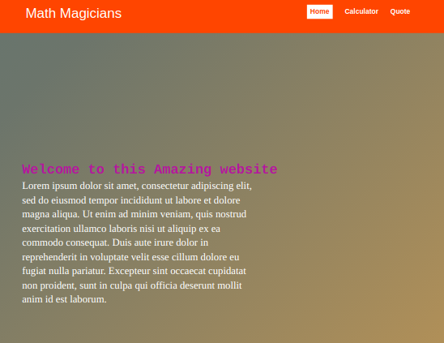
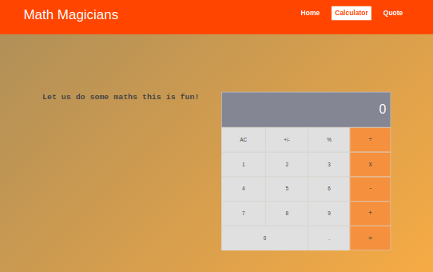
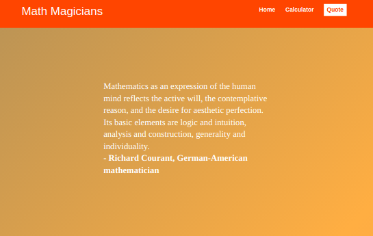

# Math Magicians

> Math magicians is a website for all fans of mathematics. It is a Single Page App (SPA) that allows users to make simple calculations,
 Read a random math-related quote. It was built using React.

 > The App consists of 3 pages: Home, Calculator, and Quote.

Additional description about the project and its features.

## Built With

- Javascript
- React
- Git, Jest

## Live Demo

[Math Magician](https://adedayoopeyemi.github.io/Math_Magicians/)

## Getting Started

To get a local copy up and running follow these simple example steps.

### Prerequisites

- Git
- Code editor of choice
- Node & Npm

### Setup

1. Navigate to your desired directory in your local machine using the terminal.

2. Clone repository by running `git clone git@github.com:AdedayoOpeyemi/math_magicians.git` in your local terminal

### Install

1. Run the following command to install the needed dependencies

    `npm install`

## Usage

1. Use the following commands to 
   `npm run start` to start the Webpack Dev server and serve the files from the dist directory
   `npm run build` to complile build all source files into the dist directory
   
   `npm run eject` to set webpack into watch mode so that the build is automatically run whenever changes are made to any of the source files.

### Run tests
  `npm run test` to set webpack into watch mode so that the build is automatically run whenever changes are made to any of the source files.

## Authors

👤 **Opeyemi Oyelesi**

- GitHub: [@AdedayoOpeyemi](https://github.com/AdedayoOpeyemi)
- Twitter: [@Oyelesiopy](https://twitter.com/oyelesiopy)
- LinkedIn: [Opeyemi Oyelesi](https://linkedin.com/in/opeyemioyelesi)

👤 **Juan Luis Gonzalez** 
- Github: [@githubhandle](https://github.com/JbirdL86)
- Twitter: [@twitterhandle](https://twitter.com/JuanLui06498455)
- Linkedin: [linkedin](https://www.linkedin.com/in/juan-luis-0551921aa/)

## 🤝 Contributing

Contributions, issues, and feature requests are welcome!

Feel free to check the [issues page](https://github.com/AdedayoOpeyemi/Math_Magicians/issues/).

## Show your support

Give a ⭐️ if you like this project!

## Acknowledgments

- Hat tip to anyone whose code was used
- Inspiration
- etc

## 📝 License

This project is [MIT](./MIT.md) licensed.
